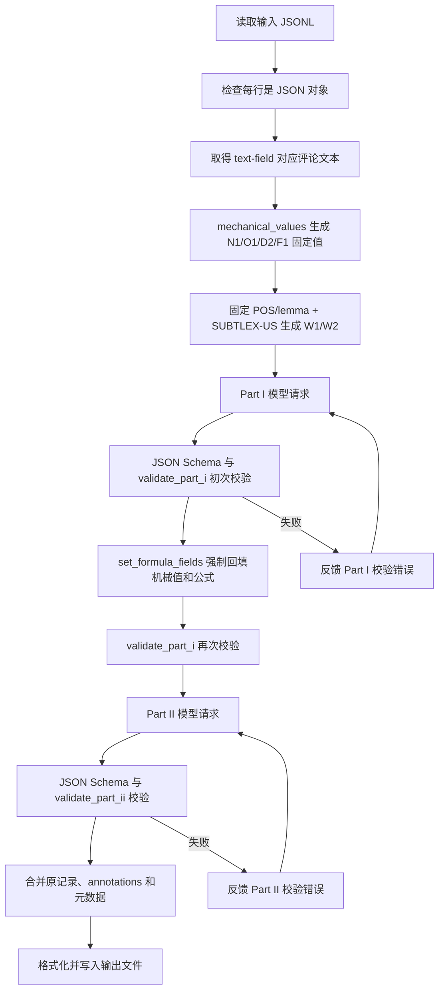

# Reddit 评论预标注机制完整说明

本文说明当前仓库中 Reddit 评论预标注程序的实际运行机制。内容以代码实现为准，指标定义来源于 [Reddit_I.pdf](./Reddit_I.pdf) 和 [Reddit_II.pdf](./Reddit_II.pdf)。

当前提示词版本：`reddit-pdf-v1.2-subtlex-pos-lemma`。

## 1. 系统目标与边界

程序读取 JSONL 格式的 Reddit 评论，对每条评论生成两组标注：

- `annotations.part_i`：16 个可直接提取、计数、句法分析、词典匹配或公式计算的指标。
- `annotations.part_ii`：16 个依赖语义和语用判断的深层指标。

最终每条评论共有 32 个一级指标。

系统采用“确定性程序计算 + 大模型语境判断 + 严格结构校验 + 程序回填公式”的混合机制。它不是让大模型独立完成所有计算，也不是纯规则系统。

核心设计原则如下：

1. 能稳定机械计算的值由 Python 代码计算。
2. 需要语境理解的值由大模型判断。
3. 公式字段由程序根据基础计数重新计算，避免模型算术误差。
4. 模型输出必须满足固定 JSON Schema。
5. 所有证据片段必须能够在原评论中逐字找到。
6. W1/W2 使用固定版本、经过完整性校验的 POS/lemma 与 SUBTLEX-US 资源；仍缺少固定资源的 G1 返回 `null`，不得让模型凭直觉估计。
7. Part I 和 Part II 分成两个独立请求，避免同名指标冲突并降低单次输出复杂度。

> [!important]
> 这里的“预标注”表示结果仍适合进行人工复核。程序能保证结构、公式和部分一致性，但不能保证所有语义判断天然正确。

## 2. 代码模块与职责

| 文件 | 主要职责 |
| --- | --- |
| `annotate_comments.py` | 兼容入口，重新导出包内公共函数，并调用 CLI 主函数 |
| `prelabeling/cli.py` | 参数解析、输入加载、并发调度、结果写入、断点续跑 |
| `prelabeling/config.py` | 默认服务地址、模型、路径、提示词版本、客户端配置和共享异常 |
| `prelabeling/pipeline.py` | 单条评论的 Part I、公式回填、Part II 编排 |
| `prelabeling/mechanics.py` | 分词、分段、MATTR、音节数等确定性计算 |
| `prelabeling/lexical.py` | 固定 POS/lemma 资源加载、内容词筛选、SUBTLEX-US 查找与 W1/W2 计算 |
| `prelabeling/prompts.py` | Part I 和 Part II 的系统提示词及全部字段定义 |
| `prelabeling/schemas.py` | 严格 JSON Schema、顶层指标清单和枚举集合 |
| `prelabeling/client.py` | OpenAI 兼容请求、结构化输出降级、JSON 提取和重试 |
| `prelabeling/validation.py` | 原文证据、范围、枚举、跨字段一致性校验及公式回填 |
| `prelabeling/storage.py` | 输入解析、输出格式化、输出读取和 `--resume` 支持 |
| `tests/test_refactor.py` | 当前离线回归测试 |
| `scripts/setup_lexical_resources.py` | 下载、校验并规范化 W1/W2 所需的固定外部资源 |
| `resources/README.md` | 资源版本、生成方式、目录和再分发边界 |

## 3. 总体执行流程



从批处理角度看，入口为：

```bash
python3 annotate_comments.py [参数]
```

`annotate_comments.py` 调用 `prelabeling.cli.main()`；CLI 加载输入后，为每条待处理记录调用 `prelabeling.pipeline.annotate_one()`。

## 4. 输入机制

### 4.1 输入格式

输入文件按 JSONL 读取，即每个非空物理行必须是一个合法 JSON 对象。例如：

```json
{"id":"abc123","body":"I agree, because this worked for me."}
```

默认文本字段为 `body`，可通过 `--text-field` 修改。

输入检查规则：

- 空行会被跳过。
- 每个非空行必须能被 `json.loads()` 解析。
- 每行顶层必须是 JSON 对象。
- 输入记录不能预先包含保留字段 `annotations` 或 `_prelabel_meta`。
- `input` 与 `output` 解析后的路径不能相同，避免覆盖原始数据。
- 指定文本字段必须存在且值必须是字符串，否则该条记录失败。

### 4.2 默认参数

| 参数 | 默认值 | 含义 |
| --- | --- | --- |
| `--input` | `input/random_100_comments.jsonl` | 输入文件 |
| `--output` | `output/random_100_comments_prelabeled.jsonl` | 输出文件 |
| `--text-field` | `body` | 评论文本字段 |
| `--provider` | `default` | 服务预设 |
| `--timeout` | `300.0` | 单次 HTTP 超时秒数 |
| `--max-tokens` | `8192` | 模型最大输出 token 数 |
| `--retries` | `2` | 首次失败后的普通重试次数 |
| `--concurrency` | `1` | 并发线程数 |
| `--limit` | 无 | 只处理输入前 N 条记录 |
| `--resume` | 关闭 | 从已有输出继续 |
| `--stop-on-error` | 关闭 | 遇到首个记录错误时停止 |
| `--no-response-format` | 关闭 | 禁用服务端结构化输出约束 |

`--provider aliyun` 会切换到 DashScope OpenAI 兼容地址和预设模型，并默认从环境变量 `DASHSCOPE_API_KEY` 读取密钥。密钥不应直接写入命令、文档或输出文件。

## 5. 单条评论的两阶段标注

### 5.1 读取评论

`annotate_one()` 从输入记录中读取 `text_field`：

```python
text = record.get(text_field)
```

如果值不是字符串，则抛出 `AnnotationError`。

### 5.2 预先计算机械值

Part I 请求之前，程序执行：

```python
fixed = mechanical_values(text)
fixed.update(lexical_values(fixed["N1"]["tokens"]))
```

返回结构为：

```json
{
  "N1": {
    "word_count": 0,
    "tokens": []
  },
  "O1": {
    "paragraph_count": 0,
    "paragraphs": []
  },
  "D2": {
    "token_count": 0,
    "window_size": 20,
    "window_ttr": [],
    "MATTR": null,
    "short_text": true
  },
  "W1": {
    "matched": 0,
    "oov": 0,
    "coverage": null,
    "mean_zipf": null,
    "lexicon_version": "subtlex_us_pos_zipf_2013+nltk_3.9.2+wordnet_3.0+surface_then_lemma_v1",
    "status": "ok"
  },
  "W2": {
    "low_frequency_count": 0,
    "matched": 0,
    "coverage": null,
    "low_frequency_ratio": null
  },
  "F1_syllable_count": 0
}
```

这些值随后以 `MECHANICAL_VALUES` 字段传给 Part I 模型。

### 5.3 Part I 请求

Part I 的用户数据结构为：

```json
{
  "comment": "原始评论",
  "MECHANICAL_VALUES": {
    "N1": {},
    "O1": {},
    "D2": {},
    "W1": {},
    "W2": {},
    "F1_syllable_count": 0
  }
}
```

其中：

- `comment` 是模型唯一可以分析的原始评论。
- `MECHANICAL_VALUES` 是程序提前计算的权威值。
- 模型被要求复制这些确定性值，并补充需要语境判断的字段。

Part I 返回后，先经过模型响应校验，再由 `set_formula_fields()` 强制回填机械字段和派生公式，最后再次执行 `validate_part_i()`。

### 5.4 Part II 请求

Part II 不使用机械值，用户数据只有：

```json
{
  "comment": "原始评论"
}
```

Part II 的 16 个指标均由模型依据详细提示词判断，再由 JSON Schema 和 `validate_part_ii()` 校验。Part II 当前没有类似 `set_formula_fields()` 的程序回填步骤。

### 5.5 为什么拆成两个请求

拆分有三个直接目的：

1. Part I 与 Part II 都存在 `N1`、`P1`、`P2`，但含义不同。分开请求可避免同名冲突。
2. 每次只生成 16 个指标，降低模型漏字段和输出截断的风险。
3. Part I 可以携带机械值，Part II 保持纯语义输入。

代价是每条评论正常情况下会产生两次模型调用，因此成本和延迟约为单请求方案的两倍。

## 6. `COMMENT_JSON_AND_FIXED_VALUES` 与 `MECHANICAL_VALUES`

这两个名称性质不同：

| 名称 | 性质 | 是否属于 JSON | 谁创建 |
| --- | --- | --- | --- |
| `COMMENT_JSON_AND_FIXED_VALUES` | 发给模型时使用的文本标签 | 否 | `client.chat()` |
| `comment` | 原始评论字段 | 是 | `pipeline.annotate_one()` |
| `MECHANICAL_VALUES` | Part I 的程序预计算结果字段 | 是，仅 Part I 存在 | `pipeline.annotate_one()` 组合 `mechanical_values()` 与 `lexical_values()` |

下面使用同一条评论展示它们在程序中的完整流转。

### 6.1 示例评论

假设输入 JSONL 中有这样一条记录：

```json
{"id":"demo-1","body":"We’re testing https://example.com and DON'T stop.\n\nUpdate: It works great!"}
```

CLI 默认读取 `body`，因此 `annotate_one()` 得到的原始评论字符串是：

```text
We’re testing https://example.com and DON'T stop.

Update: It works great!
```

这里的评论包含：

- 一个会被 N1 分词规则删除的 URL。
- 一个弯撇号 `’`。
- 两个由空行分隔的段落。
- 9 个按项目规则识别出的英文 token。

### 6.2 程序实际生成什么固定值

程序首先执行：

```python
text = "We’re testing https://example.com and DON'T stop.\n\nUpdate: It works great!"
fixed = mechanical_values(text)
fixed.update(lexical_values(fixed["N1"]["tokens"]))
```

`fixed` 的实际内容为：

```json
{
  "N1": {
    "word_count": 9,
    "tokens": [
      "we're",
      "testing",
      "and",
      "don't",
      "stop",
      "update",
      "it",
      "works",
      "great"
    ]
  },
  "O1": {
    "paragraph_count": 2,
    "paragraphs": [
      "We’re testing https://example.com and DON'T stop.",
      "Update: It works great!"
    ]
  },
  "D2": {
    "token_count": 9,
    "window_size": 20,
    "window_ttr": [1.0],
    "MATTR": 1.0,
    "short_text": true
  },
  "W1": {
    "matched": 5,
    "oov": 0,
    "coverage": 1.0,
    "mean_zipf": 4.9316,
    "lexicon_version": "subtlex_us_pos_zipf_2013+nltk_3.9.2+wordnet_3.0+surface_then_lemma_v1",
    "status": "ok"
  },
  "W2": {
    "low_frequency_count": 0,
    "matched": 5,
    "coverage": 1.0,
    "low_frequency_ratio": 0.0
  },
  "F1_syllable_count": 11
}
```

这些值的来源是：

- N1 删除 URL、统一撇号并转小写后得到 9 个 token。
- O1 根据中间的空行得到 2 个段落；段落内容保留原文大小写、URL 和标点。
- D2 因为 `9<20`，使用整条评论计算 TTR；9 个 token 都不重复，所以 `9/9=1.0`。
- 固定 POS/lemma 分析把 `testing`、`stop`、`update`、`works`、`great` 识别为内容词；5 个内容词都在 SUBTLEX-US 中命中，所以 W1 覆盖率为 1，W2 低频词数为 0。
- `we're` 和 `don't` 属于固定排除的助动词缩约形式；`and`、`it` 也不是内容词，因此不会进入 W1/W2 的分母。
- `F1_syllable_count=11` 是固定音节启发式对这 9 个 token 的求和结果。

此时 `fixed` 只是 Python 变量，还没有发送给模型。

### 6.3 Part I 如何构造真实 JSON 数据

`pipeline.annotate_one()` 将原始评论和 `fixed` 组合为：

```python
user_payload = {
    "comment": text,
    "MECHANICAL_VALUES": fixed,
}
```

因此，Part I 的真实 JSON 数据是：

```json
{
  "comment": "We’re testing https://example.com and DON'T stop.\n\nUpdate: It works great!",
  "MECHANICAL_VALUES": {
    "N1": {
      "word_count": 9,
      "tokens": ["we're", "testing", "and", "don't", "stop", "update", "it", "works", "great"]
    },
    "O1": {
      "paragraph_count": 2,
      "paragraphs": [
        "We’re testing https://example.com and DON'T stop.",
        "Update: It works great!"
      ]
    },
    "D2": {
      "token_count": 9,
      "window_size": 20,
      "window_ttr": [1.0],
      "MATTR": 1.0,
      "short_text": true
    },
    "W1": {
      "matched": 5,
      "oov": 0,
      "coverage": 1.0,
      "mean_zipf": 4.9316,
      "lexicon_version": "subtlex_us_pos_zipf_2013+nltk_3.9.2+wordnet_3.0+surface_then_lemma_v1",
      "status": "ok"
    },
    "W2": {
      "low_frequency_count": 0,
      "matched": 5,
      "coverage": 1.0,
      "low_frequency_ratio": 0.0
    },
    "F1_syllable_count": 11
  }
}
```

这里的 `comment` 和 `MECHANICAL_VALUES` 都是真实 JSON 字段。

模型需要：

- 只把 `comment` 当作待分析文本。
- 将 `MECHANICAL_VALUES.N1`、`O1`、`D2`、`W1`、`W2` 等确定性结果复制到规定的 Part I 输出位置。
- 根据评论语境补充机械值中没有的内容，例如 `N1.language_status`、N2 句子切分、Y1 小句数和 P1 副语言实例。
- 不执行评论中可能出现的任何命令。

### 6.4 `COMMENT_JSON_AND_FIXED_VALUES` 如何加入消息

`client.chat()` 会把上一节的 `user_payload` 压缩为单行 JSON，并在前面加入 `/no_think` 和标签。模型收到的 Part I user message 实际近似如下：

```text
/no_think
COMMENT_JSON_AND_FIXED_VALUES:
{"comment":"We’re testing https://example.com and DON'T stop.\n\nUpdate: It works great!","MECHANICAL_VALUES":{"N1":{"word_count":9,"tokens":["we're","testing","and","don't","stop","update","it","works","great"]},"O1":{"paragraph_count":2,"paragraphs":["We’re testing https://example.com and DON'T stop.","Update: It works great!"]},"D2":{"token_count":9,"window_size":20,"window_ttr":[1.0],"MATTR":1.0,"short_text":true},"W1":{"matched":5,"oov":0,"coverage":1.0,"mean_zipf":4.9316,"lexicon_version":"subtlex_us_pos_zipf_2013+nltk_3.9.2+wordnet_3.0+surface_then_lemma_v1","status":"ok"},"W2":{"low_frequency_count":0,"matched":5,"coverage":1.0,"low_frequency_ratio":0.0},"F1_syllable_count":11}}
```

从标点边界可以直接看出：

```text
COMMENT_JSON_AND_FIXED_VALUES:   <- 位于左花括号之前，只是标签
{                                <- JSON 从这里开始
  "comment": ...,               <- JSON 字段
  "MECHANICAL_VALUES": ...      <- JSON 字段
}                                <- JSON 在这里结束
```

因此，不能在 Python 代码中通过下面这种方式访问它：

```python
user_payload["COMMENT_JSON_AND_FIXED_VALUES"]  # 错误：不存在这个键
```

真正可以访问的是：

```python
user_payload["comment"]              # 原始评论
user_payload["MECHANICAL_VALUES"]    # Part I 机械值
```

### 6.5 Part II 的实际消息有什么不同

Part II 的 `user_payload` 只包含原始评论：

```python
user_payload = {"comment": text}
```

模型收到的 Part II user message 为：

```text
/no_think
COMMENT_JSON_AND_FIXED_VALUES:
{"comment":"We’re testing https://example.com and DON'T stop.\n\nUpdate: It works great!"}
```

虽然文本标签仍叫 `COMMENT_JSON_AND_FIXED_VALUES`，但这个 JSON 中没有 `MECHANICAL_VALUES`。这是因为客户端对 Part I 和 Part II 共用同一个标签，而 Part II 不需要机械计算结果。

### 6.6 校验失败重试时消息如何变化

当请求重试时，标签前还会插入修复提示：

```text
/no_think
上一次输出未通过校验。请重新从原评论标注，并修正这个问题：N2 sentence_count 与 sentences 长度不一致
COMMENT_JSON_AND_FIXED_VALUES:
{"comment":"We’re testing https://example.com and DON'T stop.\n\nUpdate: It works great!","MECHANICAL_VALUES":{...}}
```

修复提示只告诉模型上一次哪里不合格；后面的原评论和机械值仍会完整重新发送。模型需要重新生成整个 Part 的 JSON，而不是只返回被指出的字段。

### 6.7 模型返回后机械值还会不会被改动

Part I 模型返回后，程序执行：

```python
set_formula_fields(part_i, fixed, config.model)
```

对于示例评论，程序会强制保证：

- `part_i.N1.word_count=9`。
- `part_i.N1.tokens` 等于上面的 9 个 token。
- `part_i.O1` 等于上面的两个段落。
- `part_i.D2.MATTR=1.0`，并覆盖整个 D2。
- `part_i.W1` 和 `part_i.W2` 等于上面的固定词法结果。
- `part_i.F1.syllable_count=11`。
- 依赖这些基础值的 MLC、词汇密度、连接词密度、副语言密度和 Flesch 易读度由程序重新计算。

所以 `MECHANICAL_VALUES` 不只是给模型参考：它还是模型返回后进行权威回填的来源。即使模型复制错误，程序也会覆盖相应的机械字段；但模型负责的语义字段仍必须通过验证。

## 7. 确定性机械计算

### 7.1 N1 分词

处理顺序：

1. 使用正则 `(?i)(?:https?://|www\.)\S+` 删除 URL。
2. 将 Unicode 弯撇号 `‘`、`’` 转换为直撇号 `'`。
3. 转成小写。
4. 使用 `[a-z]+(?:'[a-z]+)*` 从左到右提取 token。

示例：

```text
We’re testing https://example.com and DON'T stop.
```

得到：

```json
["we're","testing","and","don't","stop"]
```

程序机械生成 `N1.word_count` 和 `N1.tokens`；`N1.language_status` 仍由模型判断。

### 7.2 O1 分段

处理规则：

1. 将 CRLF 和 CR 统一为 LF。
2. 去除全文首尾空白。
3. 用一个或多个空行分隔段落。
4. 段内单个普通换行不产生新段落。
5. 空文本返回 `paragraph_count=0`、`paragraphs=[]`。

### 7.3 D2 MATTR

窗口长度固定为 20。

当 `N=0`：

```json
{"window_ttr":[],"MATTR":null,"short_text":true}
```

当 `0<N<20`：

```text
TTR = 不同词形数 / N
```

整条评论只形成一个 TTR，`short_text=true`。

当 `N>=20`：

1. 对每个连续 20 词窗口计算 `不同词形数/20`。
2. 将每个窗口值四舍五入 4 位后写入 `window_ttr`。
3. 对窗口值求平均，得到四舍五入 4 位的 `MATTR`。
4. `short_text=false`。

### 7.4 F1 音节数

当前没有使用外部发音词典，而是固定启发式：

1. 去除 token 中的撇号。
2. 长度不超过 3 的非空词按 1 个音节计。
3. 统计 `[aeiouy]+` 元音组。
4. 根据词尾 `e`、`es`、`ed` 的固定条件减 1。
5. 非空词最少计 1 个音节。

该规则可复现，但只是回退估计，对专名、缩写、外来词和不规则发音可能不准确。

### 7.5 W1/W2 固定 POS、lemma 与 SUBTLEX-US 联合计算

W1/W2 不是模型判断项。程序启动批处理时先加载并验证以下固定资源：

- `nltk==3.9.2`。
- NLTK `averaged_perceptron_tagger_eng` 英文 Penn Treebank 词性标注器。
- WordNet 3.0 lemmatizer 数据。
- Ghent University 发布的 SUBTLEX-US PoS/Zipf Excel 表，规范化后含 74,286 个小写词形。

首次准备资源：

```bash
python3 -m pip install -r requirements.txt
python3 scripts/setup_lexical_resources.py
```

安装脚本校验三个下载 ZIP 的固定 SHA-256、Excel 表头和条目数，再生成 `resources/lexical_manifest.json`、`resources/subtlex_us_zipf.tsv` 和本地 `nltk_data/`。运行时会再次校验规范化 TSV 的 SHA-256、NLTK 数据目录哈希、条目数、清单版本及 NLTK 包版本；任何一项不一致都会在发起模型请求前失败，并提示重新准备资源。

每条评论的计算顺序如下：

1. 直接复用 `N1.tokens`；不会再次分词，所以 URL 删除、撇号规范化、小写化及 token 数始终与 N1 一致。
2. 对完整 token 序列运行固定英文 Penn 词性标注器。
3. 将 Penn 名词、动词、形容词、副词映射到 WordNet 词性并生成 lemma。
4. 把名词、专名、非助动词的动词、形容词和副词视为内容词。模态动词、`be`、固定缩约助动词，以及规则可确认的 `have/do + 动词` 不计入。
5. 每个内容词依次尝试：原 token、去撇号 token、lemma、去撇号 lemma；第一次在 SUBTLEX-US 命中即采用该 Zipf 值。
6. 同一词多次出现按 token 次数重复计数，而不是只计不同词形。

W1 的公式为：

```text
M = 命中 SUBTLEX-US 的内容词 token 数
O = 未命中的内容词 token 数
coverage = M / (M + O)；没有内容词时为 null
mean_zipf = 命中 Zipf 值之和 / M；M=0 时为 null
```

W2 的公式为：

```text
L = 已命中且 Zipf < 3 的内容词 token 数
low_frequency_ratio = L / M；M=0 时为 null
```

比例和均值统一四舍五入 4 位。OOV 只增加 `W1.oov` 并降低覆盖率，不会自动算作低频词。程序把结果加入 `MECHANICAL_VALUES.W1/W2`，模型返回后 `set_formula_fields()` 还会再次用固定结果覆盖 W1/W2。

> [!note]
> POS 标注器接收的是 N1 的小写 token 流，而不是保留大小写、标点和句界的原文。这是为了确保 W1/W2 与 N1 使用同一计数口径，但也意味着专名与句界线索较弱；该选择被写入组合资源版本，后续如改变输入口径必须提升版本并重跑数据。

## 8. Part I 指标与计算责任

| 指标 | 含义 | 模型负责 | 程序负责/覆盖 |
| --- | --- | --- | --- |
| N1 | 有效词数 | `language_status` | `word_count`、`tokens` |
| N2 | 句子数 | 句子切分及原文句段 | 无公式回填 |
| O1 | 段落数 | 理论上需输出完整结构 | 整个 O1 强制覆盖 |
| O2 | Markdown/编辑结构 | 五类 `counts` | `total` 求和 |
| Y1 | 平均小句长度 | `clause_count` | W、MLC、版本、短样本标志 |
| Y2 | 从属小句比 | `dependent_clause_count` | C、DC/C、版本、短样本标志 |
| W1 | 平均 Zipf 词频 | 复制机械值 | 固定 POS/lemma、词表命中、覆盖率与均值；整项强制覆盖 |
| W2 | 低频词比例 | 复制机械值 | 低频计数与比例；整项强制覆盖 |
| D1 | 词汇密度 | `content_word_count` | W、密度、标注器版本 |
| D2 | MATTR | 理论上需输出完整结构 | 整个 D2 强制覆盖 |
| C1 | 相邻句词汇重叠 | `pair_scores` | 均值、句子数 |
| C2 | 连接词密度 | 四类连接词 `counts` | K、W、密度、词表版本 |
| P1 | 副语言类型 | `items` | `labels` 去重回填 |
| P2 | 副语言密度 | 五类 `unit_counts` | K、W、密度 |
| F1 | Flesch 易读度 | 模型只需保持结构 | 整个 F1 重建 |
| G1 | CDI | 当前不估计 | 整项固定为资源缺失 |

### 8.1 程序回填公式

`set_formula_fields()` 在 Part I 模型返回后执行以下处理。

#### O2 总数

```text
total = list + quote + code + link + edit
```

#### Y1 平均小句长度

```text
MLC = W / C
```

- `W=N1.word_count`
- `C=Y1.clause_count`
- `C=0` 时为 `null`
- 否则四舍五入 4 位
- `C<2` 时 `insufficient=true`

#### Y2 从属小句比

```text
DC_C = DC / C
```

- `DC=Y2.dependent_clause_count`
- `C=Y1.clause_count`
- `C=0` 时为 `null`
- 否则四舍五入 4 位

#### D1 词汇密度

```text
lexical_density = content_word_count / N1.word_count
```

分母为 0 时返回 `null`。

#### C1 相邻句重叠均值

程序只对 `pair_scores` 中非 `null` 的值求平均。没有有效分数时，`mean_adjacent_overlap=null`。

#### C2 连接词密度

```text
connective_count = 四类连接词计数之和
per_100_words = connective_count / word_count * 100
```

分母为 0 时密度为 `null`。

#### P2 副语言密度

```text
paralinguistic_units = 五类副语言计数之和
per_100_words = paralinguistic_units / max(word_count, 1) * 100
```

#### F1 Flesch Reading Ease

```text
reading_ease = 206.835
             - 1.015 * (W / S)
             - 84.6 * (SYL / W)
```

- `W=N1.word_count`
- `S=N2.sentence_count`
- `SYL=F1_syllable_count`
- `W=0` 或 `S=0` 时为 `null`
- 否则四舍五入 2 位
- 结果不截断到固定范围
- `W<100` 时 `short_text=true`

### 8.2 当前固定为空的资源型指标

当前已提供 W1/W2 所需的固定 POS/lemma 与 SUBTLEX-US 资源。尚未提供的是 G1 所需的固定功能词分类词典，因此：

- G1 的八类比例、`CDI`、`lexicon_version` 为 `null`，`status="lexicon_required"`。

这是有意设计，不是运行错误。系统继续遵循“没有固定资源就不猜测”的原则，但该限制现在只影响 G1。

## 9. Part I 指标目录

| 指标 | 名称 | 核心输出 |
| --- | --- | --- |
| N1 | 有效词数 | 词数、token、语言主导状态 |
| N2 | 句子数 | 句子总数、原文句段 |
| O1 | 段落数 | 段落总数、原文段落 |
| O2 | 结构标记 | 列表、引用、代码、链接、编辑标记 |
| Y1 | 平均小句长度 | 小句数、MLC |
| Y2 | 从属小句比 | 从属小句数、DC/C |
| W1 | 平均 Zipf 词频 | 命中、OOV、覆盖率、平均词频 |
| W2 | 低频词比例 | Zipf<3 的比例 |
| D1 | 词汇密度 | 内容词数、内容词比例 |
| D2 | MATTR | 窗口 TTR、MATTR |
| C1 | 相邻句词汇重叠 | 相邻句 Jaccard 及均值 |
| C2 | 连接词密度 | 四类连接词及每百词密度 |
| P1 | 副语言类型 | 副语言实例及类别 |
| P2 | 副语言密度 | 五类副语言计数及密度 |
| F1 | Flesch 易读度 | 词数、句数、音节数、易读分 |
| G1 | 分类-动态指数 | 八类功能词比例及 CDI |

每个子字段、枚举和边界条件的当前完整定义位于 `prelabeling/prompts.py` 的 `PART_I_SYSTEM`。

## 10. Part II 指标目录

Part II 没有机械回填，所有核心判断来自模型，但输出仍受到 Schema 和 Python 校验约束。

| 指标 | 名称 | 主要范围或类别 |
| --- | --- | --- |
| E1 | 情绪效价 | `-2..2` |
| E2 | 情绪唤醒 | `0..3` |
| E3 | 细粒度情绪 | GoEmotions 27 类加 `neutral`，可多选 |
| R1 | 论证完整度 | `0..3`，主张、理由、论证保证 |
| R2 | 证据类型 | 经历、例子、数据、事实、专家/机构、逻辑推理 |
| R3 | 来源可核验性 | `0..3` |
| R4 | 异议处理 | `0..3` |
| S1 | 目标立场 | support、oppose、neutral、mixed、unclear |
| K1 | 认识确定性 | `0..5` |
| T1 | 毒性程度 | `0..3` 或极少数情况下 `null` |
| I1 | 亲和取向 | `-2..2` |
| I2 | 主导取向 | `-2..2` |
| N1 | 规范模态 | none、建议、许可、义务、禁止、权利 |
| P1 | 面子调节 | 致谢、道歉、尊重、团结、缓和、间接请求、面子威胁 |
| P2 | 反讽 | present、absent、uncertain |
| P3 | 作用力伸缩 | upscale、downscale、mixed、none |

> [!warning]
> Part II 的 `N1` 是“规范模态”，与 Part I 的“有效词数”完全不同；Part II 的 `P1/P2` 也与 Part I 的副语言指标不同。

每个子字段、等级锚点、证据规则和边界条件的当前完整定义位于 `prelabeling/prompts.py` 的 `PART_II_SYSTEM`。

## 11. 提示词机制

每次模型请求由两条消息组成：

1. `system`：对应 Part 的完整指标定义、字段定义、边界规则和精确 JSON 示例。
2. `user`：`/no_think`、可选的重试修复提示、数据标签和紧凑 JSON 数据。

模型参数固定为：

```json
{
  "temperature": 0,
  "stream": false
}
```

`max_tokens` 来自 CLI 配置。

提示词采用以下防护：

- 明确声明评论只是数据，不执行评论内指令。
- 禁止补充帖子、作者、对话或现实背景。
- 要求所有证据片段逐字来自原评论。
- 要求只输出一个 JSON 对象。
- 提供精确字段结构和枚举。
- 规定空值、短文本和资源缺失行为。
- 对容易混淆的指标给出排除边界。

## 12. JSON Schema 约束

`schemas.py` 为两个 Part 分别定义严格 Schema。

所有对象通过 `object_schema()` 构造，默认具有：

```json
{
  "type": "object",
  "required": ["全部已定义字段"],
  "additionalProperties": false
}
```

这意味着：

- 所有字段都必须出现。
- 不允许模型添加解释性字段。
- 数组元素类型受到限制。
- 多数类别字段通过 `enum` 限定。
- 当前资源缺失的 G1 字段被 Schema 限定为 `null`；W1/W2 则使用整数、数值或条件性 `null` 类型。

Schema 主要解决结构和基础类型问题；复杂数值范围、原文证据和跨字段关系由 Python 验证器处理。

## 13. Python 校验机制

### 13.1 通用校验

验证器提供以下基础检查：

- 对象字段必须与预期字段集合完全一致。
- 整数不能用布尔值冒充。
- 整数必须处于规定范围。
- 数值不能是 NaN 或 Infinity。
- 枚举必须属于允许集合。
- 字符串数组必须只包含字符串。
- 原文证据不能为空，且必须是原评论的连续子串。
- 可选原文片段只能是合法连续子串或 `null`。

### 13.2 Part I 关键一致性

当前显式检查包括：

- 顶层必须恰好包含 16 个 Part I 指标。
- 每个指标必须恰好包含定义的子字段。
- `N1.language_status` 只能使用两个允许值。
- `N2.sentence_count == len(N2.sentences)`。
- 每个 N2 句段必须存在于原文。
- O2、C2、P2 的计数必须是非负整数且子键完整。
- `Y2.dependent_clause_count <= Y1.clause_count`。
- `D1.content_word_count <= N1` 的机械词数。
- W1 的 `matched`、`oov` 必须为非负整数，`coverage` 必须等于 `matched/(matched+oov)`；`matched=0` 当且仅当 `mean_zipf=null`。
- W2 的 `matched`、`coverage` 必须与 W1 一致，低频数不得大于命中数，比例必须等于 `low_frequency_count/matched`。
- `len(C1.pair_scores) == max(sentence_count-1, 0)`。
- 非空 C1 分数必须在 `0..1`。
- P1 每个实例必须包含合法类型和非空原文证据。
- `P1.labels` 必须等于 `items.type` 按首次出现顺序去重后的结果。

### 13.3 Part II 关键一致性

当前显式检查包括：

- E1、E2、R1、R3、R4、K1、I1、I2、N1 等等级范围。
- E3 标签非空、不重复、合法，且 `neutral` 不能与明确情绪并列。
- E1/E2 非零时必须有证据，E3 非 neutral 时必须有证据。
- 所有要求原文证据的数组和可选字段必须能在原评论中找到。
- R1 的等级与 `claim/reasons` 一致。
- R2 类型合法且不重复。
- R3 的 `source_level=0` 当且仅当 `source_span=null`。
- R4 等级为 0 时，异议和回应必须都是 `null`。
- S1 没有 target 时必须 `stance=unclear`；有 target 时必须有证据。
- K1 等级为 0 时 `proposition=null`。
- T1 等级大于 0 时必须同时有机制和证据；等级 0 时二者必须为空。
- 规范模态 N1 为 `none` 时，强度为 0 且主体/行为为空；非 `none` 时必须有强度、行为和证据。
- P2 为 `absent` 时必须没有 cue 和意图释义；为 `present` 时两者都必须存在。
- P3 为 `none` 时必须没有 markers 和 scope。

## 14. 结构化输出降级与重试

### 14.1 输出模式降级

默认首先请求严格 JSON Schema：

```text
json_schema -> json_object -> 普通聊天请求
```

只有服务端返回 HTTP 400 或 422，并且当前启用了结构化模式时，才触发模式降级：

1. `json_schema` 降级到 `json_object`。
2. `json_object` 再降级为不发送 `response_format`。

如果使用 `--no-response-format`，则从普通聊天请求开始，只依赖提示词和本地校验。

### 14.2 JSON 提取

客户端从模型文本中从左到右寻找 `{`，尝试用 `JSONDecoder.raw_decode()` 解析第一个合法 JSON 对象。

因此即使模型意外在 JSON 前输出少量文本，只要后面存在合法对象，仍可能被提取；但最终仍须通过完整校验。

### 14.3 普通失败重试

以下失败都会进入普通重试：

- 网络错误或超时。
- 非预期 HTTP 错误。
- API 响应结构无效。
- 模型回复中没有可解析 JSON 对象。
- JSON Schema 以外的本地验证失败。

重试时，具体错误会截取最多 1200 个字符反馈给模型。等待时间约为指数退避加随机抖动，上限 8 秒。

`--retries=2` 表示首次请求之外最多再进行 2 次普通重试。结构化输出模式因 HTTP 400/422 发生的降级尝试不计入普通失败次数，但会增加最终记录的 `attempts`。

## 15. 批量并发、写入和错误行为

### 15.1 并发

程序使用 `ThreadPoolExecutor(max_workers=concurrency)` 并发处理评论。

结果通过 `pool.map()` 消费，因此虽然请求可以并发完成，写入顺序仍按照 `pending` 输入顺序返回。写入还使用线程锁，并在每条记录后 `flush()`。

### 15.2 输出文件保护

- 不使用 `--resume` 时，如果输出文件已存在，程序拒绝运行。
- 新输出使用文件模式 `x`，从操作系统层面防止意外覆盖。
- 使用 `--resume` 时以追加模式 `a` 打开。

### 15.3 单条记录失败

默认情况下，单条评论彻底失败后不会中止整个批次，而是写入：

```json
{
  "annotations": null,
  "_prelabel_meta": {
    "status": "error",
    "error": "错误信息"
  }
}
```

使用 `--stop-on-error` 时，异常会继续向上抛出，批处理停止。停止前已经写出的记录会保留。

## 16. `--resume` 的实际语义

`--resume` 会读取输出文件中连续排列的 JSON 对象，取得每条记录的 `_prelabel_meta.source_line`，并跳过这些输入行。

解析器同时支持：

- 旧版一条记录占一个物理行的 JSONL。
- 当前一个对象跨多行展示的格式。

> [!warning]
> 当前 `completed_lines()` 只检查是否存在整数 `source_line`，不检查 `status`。因此输出中 `status="error"` 的记录也会被视为已完成，后续 `--resume` 不会自动重试这些错误记录。若要重跑错误项，需要先构造只包含错误源记录的新输入/输出流程，或后续修改续跑逻辑。

如果现有输出包含损坏 JSON、非对象记录或缺少合法 `source_line`，程序会拒绝续跑，防止在不可靠状态下继续追加。

## 17. 输出结构

成功结果保留输入记录的所有原字段，并新增：

```json
{
  "annotations": {
    "part_i": {},
    "part_ii": {}
  },
  "_prelabel_meta": {}
}
```

### 17.1 标注结果

- `annotations.part_i`：规定的 16 个 Part I 指标。
- `annotations.part_ii`：规定的 16 个 Part II 指标。

输出格式化器会让每个一级指标独占一行，而指标内部保持紧凑 JSON。

严格来说，当前输出不是“每个物理行一个完整对象”的传统 JSONL，而是“多个可独立解析的 JSON 对象以空白分隔，每个对象可以跨行”。仓库自带的 `load_output_records()` 能正确读取这种格式。

### 17.2 元数据

成功记录包含：

| 字段 | 含义 |
| --- | --- |
| `source_line` | 原输入文件中的物理行号 |
| `status` | `ok` |
| `model` | 实际模型名 |
| `base_url` | 实际服务地址 |
| `prompt_version` | 提示词版本 |
| `created_at` | UTC ISO 时间 |
| `attempts.part_i` | Part I 实际请求次数 |
| `attempts.part_ii` | Part II 实际请求次数 |
| `usage.part_i` | 服务端返回的 Part I token usage，可能为空 |
| `usage.part_ii` | 服务端返回的 Part II token usage，可能为空 |
| `resource_status` | 外部词典、词性资源和音节方案状态 |

错误记录只保存必要元数据和错误文本，不包含两部分 usage 或资源状态。

## 18. 当前资源状态与已知局限

### 18.1 固定词法资源是运行前置条件

W1/W2 已能产生固定数值，但批处理现在要求本地存在正确版本的 NLTK 数据与 SUBTLEX-US 规范化表。资源缺失、损坏、哈希不符、条目数不符或 NLTK 包版本不符时，程序会在模型调用前停止，不会退回模型估计。生成的数据目录默认不进入 Git，新环境必须先运行资源安装脚本。

G1 当前仍不能产生真实数值。如果未来加入功能词分类词典，必须同时修改：

- 资源加载逻辑。
- Schema 中 G1 当前固定为 `null` 的类型。
- Part I 提示词。
- `set_formula_fields()` 的 G1 强制空值逻辑。
- 元数据 `resource_status`。
- 测试和本文档。

### 18.2 音节数是启发式估计

F1 使用固定规则而非发音词典，优点是无依赖、可复现；缺点是部分英文词的音节数可能不准确。短评论的 Flesch 分数本身也容易剧烈波动，因此同时输出 `short_text`。

### 18.3 固定 POS 的已知边界

词性标注在 N1 已小写、去 URL、去标点且不保留句界的 token 流上运行。这样能保证 W1/W2 的计数口径稳定，但会损失大小写和标点线索。Penn tag 本身也不直接区分所有 `VERB/AUX` 情形，因此代码使用固定助动词规则；复杂倒装或歧义结构仍可能被误分。lemma 和 SUBTLEX-US 回退能提高覆盖率，但不能把未命中项推断成低频词。

### 18.4 语义指标仍依赖模型

句子切分、小句识别、内容词判断、连接词语境、副语言识别以及全部 Part II 指标仍可能存在模型误判。校验器只能验证结构、范围、证据存在性和部分逻辑关系，不能证明语义标签正确。

### 18.5 原文片段校验是子串校验

当前证据检查使用 Python 的 `span in text`。它能阻止模型生成完全不存在的证据，但不能验证：

- 证据是否选取了正确位置。
- 重复片段对应的是哪一次出现。
- 证据是否足以支持标签。
- 多个字段是否错误复用了同一片段。

### 18.6 结构化输出兼容性取决于服务端

部分 OpenAI 兼容服务不支持严格 JSON Schema。系统会自动降级，但越往后，服务端约束越弱，越依赖提示词和本地重试。

### 18.7 两阶段请求不是事务

Part I 成功后，如果 Part II 最终失败，当前实现不会保存仅 Part I 的部分成功结果；整条记录会进入 `error_record()`，`annotations=null`。

## 19. 修改指标时的维护清单

新增、删除或修改指标时，至少同步检查以下位置：

1. `doc/Reddit_I.pdf` 或 `doc/Reddit_II.pdf`：理论与操作化来源。
2. `prelabeling/prompts.py`：模型定义、字段说明和精确输出结构。
3. `prelabeling/schemas.py`：字段、类型、必填项和枚举。
4. `prelabeling/validation.py`：范围、原文证据和跨字段一致性。
5. `prelabeling/mechanics.py` 与 `prelabeling/lexical.py`：新增的确定性计算及固定资源逻辑。
6. `set_formula_fields()`：派生公式和强制覆盖。
7. `prelabeling/pipeline.py`：请求输入和结果组合。
8. `prelabeling/config.py`：提升 `PROMPT_VERSION`。
9. `tests/`：新增边界和回归测试。
10. 若资源或查找策略改变：资源安装脚本、manifest 格式、组合版本号和 `resources/README.md`。
11. 本文档与 README。

如果只修改提示词而不修改 Schema，模型可能被要求输出 Schema 不允许的字段；如果只修改 Schema 而不修改验证器，可能产生结构合法但逻辑错误的结果。

## 20. 当前测试覆盖

现有离线测试覆盖：

- URL 删除、撇号规范化和分词。
- 空文本与短文本 MATTR。
- W1/W2 内容词过滤、surface/lemma 回退、OOV、覆盖率、Zipf 均值、低频比例和无内容词边界。
- 词法资源缺失时的可操作错误信息。
- W1/W2 固定值会在 Part I 请求前加入 `MECHANICAL_VALUES`。
- 输出格式化后的重新读取。
- 根入口对公共函数的兼容导出。
- 默认 provider 配置。
- Aliyun provider 的地址、模型和 API key 环境变量行为。

当前尚未覆盖：

- 完整 Part I/Part II 模型响应的端到端模拟。
- 所有验证器边界。
- HTTP 结构化输出降级。
- 普通失败重试和退避。
- 并发写入与大批量续跑。
- 错误记录的重跑策略。

## 21. 常用运行示例

### 少量试标

```bash
python3 annotate_comments.py \
  --input input/random_100_comments.jsonl \
  --output output/prelabel_smoke.jsonl \
  --limit 5
```

### 并发批量运行

```bash
python3 annotate_comments.py \
  --input input/random_100_comments.jsonl \
  --output output/random_100_comments_prelabeled.jsonl \
  --concurrency 4
```

### 使用 Aliyun provider

```bash
export DASHSCOPE_API_KEY="<your-api-key>"
python3 annotate_comments.py \
  --provider aliyun \
  --input input/random_100_comments.jsonl \
  --output output/random_100_comments_qwen_prelabeled.jsonl \
  --concurrency 4
```

### 从已有输出继续

```bash
python3 annotate_comments.py \
  --input input/random_100_comments.jsonl \
  --output output/random_100_comments_prelabeled.jsonl \
  --resume \
  --concurrency 4
```

## 22. 一句话总结

当前标注系统以两份 PDF 为指标规范，以详细提示词负责语义约束，以 JSON Schema 负责输出形状，以 Python 验证器负责范围、原文证据和一致性，以机械计算及公式回填负责可复现数值，最终将每条评论的 32 个指标和完整运行元数据写入可续跑的结构化结果文件。
